<!-- Repository Information & Links-->
<br />

[](https://github.com/inesmith/PetPulse)
[](https://github.com/inesmith/PetPulse/watchers)
[](https://github.com/inesmith/PetPulse)
[](https://github.com/inesmith/PetPulse)

<!-- HEADER SECTION -->
<h5 align="center" style="padding:0;margin:0;">Iné Smith - 221076</h5>

<h6 align="center">Interactive Development 300 • 2025</h6>
</br>
<p align="center">

  <div align="center" href="https://github.com/inesmith/PetPulse">
    
  </div>
  
  <h3 align="center">PetPulse</h3>

  <p align="center">
    A mobile (iOS/Android) pet wellness & activity tracker built with Expo (React Native) and Firebase.
    Track walks on a live map, save activities per pet, see Steps Today & Distance (from saved sessions only), manage reminders, and earn rewards via monthly “do-to-earn” challenges. <br>
      <a href="https://github.com/inesmith/PetPulse"><strong>Explore the docs »</strong></a>
   <br />
   <br />
   <a href="">View Demo</a>
    ·
    <a href="https://github.com/inesmith/PetPulse/issues">Report Bug</a>
    ·
    <a href="https://github.com/inesmith/PetPulse/issues">Request Feature</a>
</p>

<!-- TABLE OF CONTENTS -->

## Table of Contents

- [Table of Contents](#table-of-contents)
- [About the Project](#about-the-project)
  - [Project Description](#project-description)
  - [Built With](#built-with)
- [Getting Started](#getting-started)
  - [Prerequisites](#prerequisites)
  - [Installation](#installation)
  - [Invironment & Keys](#invironment-&-keys)
  - [Run](#Run)
- [Features and Functionality](#features-and-functionality)
  - [Authentication](#authentication)
  - [Pet Management](#pet-management)
  - [Activities & GPS Tracking](#activities-&-gps-tracking)
  - [Reminders](#reminders)
  - [Rewards](#rewards)
- [PetPulse Screens](#petpulse-screens)
  - [Authentication Screens](#authentication-screens)
  - [Home Screen](#home-screen)
  - [Settings Sreens](#settings-screens)
  - [Pet Profile Screen](#pet-profile-screen)
  - [Health Screen](#health-screen)
  - [Activities Sreens](#activities-screen)
  - [Map Sreens](#map-screen)
- [Architecture \& Components](#architecture--components)
  - [Component Structure](#component-structure)
  - [State & Data Management](#state-&-data-management)
  - [Firestore Structure & Integration](#firestore-structure-&-integration)
  - [Security Rules](#security-rules)
- [Concept Process](#concept-process)
  - [Ideation](#ideation)
  - [Wireframes](#wireframes)
  - [ER-Diagram](#er-diagram)
- [Development Process](#development-process)
  - [Implementation Process](#implementation-process)
  - [Highlights](#highlights)
  - [Challenges](#challenges)
  - [Reviews \& Testing](#reviews--testing)
    - [Test Coverage Overview](#test-coverage-overview)
    - [Testing Tools \& Framework](#testing-tools--framework)
  - [Future Implementation](#future-implementation)
- [Final Outcome](#final-outcome)
  - [Mockups](#mockups)
  - [Video Demonstration](#video-demonstration)
- [Roadmap](#roadmap)
- [Contributing](#contributing)
- [Authors](#authors)
- [License](#license)
- [Contact](#contact)
- [Acknowledgements](#acknowledgements)

<!--PROJECT DESCRIPTION-->

## About the Project


### Project Description

PetPulse helps pet owners log and visualize daily activities. Start a tracked walk, see a live route, then finish and save the session. Only finished sessions contribute to Steps Today and Distance Today (per pet; resets daily). Upload a profile picture per pet, manage reminders, and earn rewards via monthly rotating to-dos (e.g., “Take your pet to the park 3 times this week”).

PetPulse helps owners build healthy routines for their pets by:

- Creating pet profiles with photos.

- Tracking walks on a live map; when you end & save the session, it logs meters, steps, time, and path.

- Home and Activities screens show Steps Today and Distance using saved sessions only for the currently selected pet.

- Managing per-pet reminders (e.g., meds, grooming).

- Earning rewards via monthly challenge to-dos (e.g., “Go to the park 3× this week”), view next reward progress, and redeem earned rewards (moved to archive).

### Built With

- **Mobile Framework**: [React Native](https://reactnative.dev/) via [Expo](https://expo.dev/)
- **Language**: [TypeScript](https://www.typescriptlang.org/)
- **Navigation**: [React Navigation](https://reactnavigation.org/) (`@react-navigation/native`, `@react-navigation/native-stack`)
- **UI**: [Gluestack UI](https://gluestack.io/), React Native `StyleSheet`s, and [`react-native-safe-area-context`](https://github.com/th3rdwave/react-native-safe-area-context)
- **Icons**: [Ionicons](https://ionic.io/ionicons) via `@expo/vector-icons`
- **Maps**: [`react-native-maps`](https://github.com/react-native-maps/react-native-maps) (Google Maps provider)
- **Location**: [`expo-location`](https://docs.expo.dev/versions/latest/sdk/location/)
- **Image Picker**: [`expo-image-picker`](https://docs.expo.dev/versions/latest/sdk/imagepicker/)
- **Backend & Data**: [Firebase](https://firebase.google.com/) — Authentication, Cloud Firestore, Cloud Storage
- **State Management**: React Context API (custom `AuthContext`, `PetContext`)
- **Build/Dev**: Expo CLI & Metro bundler

<!-- GETTING STARTED -->

## Getting Started

The following instructions will get you a copy of the project up and running on your local machine for development and testing purposes.

### Prerequisites

Ensure that you have the latest version of [Node.js](https://nodejs.org/) (v16 or higher) installed on your machine. You'll also need [npm](https://www.npmjs.com/) which comes bundled with Node.js.

- Node.js 18+

- npm

- iOS (Xcode) and/or Android (Android Studio) tooling

- A Firebase project with Auth, Firestore, and Storage enabled

### Installation

Here are the steps to clone and run this project:

1.  **Clone Repository**  
    Run the following in the command-line to clone the project:

    ```sh
    git clone https://github.com/inesmith/PetPulse
    ```

2.  **Navigate to Project Directory**

    ```sh
    cd PetPulse
    ```

3.  **Install Dependencies**  
    Run the following to install all required dependencies:

    ```sh
    npm install
    ```

4.  **Environment Setup**  
     Follow these steps to configure Firebase, Google Maps, and app permissions for PetPulse.

    1. Create a Firebase project

       - Go to Firebase Console → Add project.

       - In Build → Authentication → Sign-in method, enable Email/Password.

       - In Build → Firestore Database, create a database (Start in production or test, your choice).

       - In Build → Storage, create a default bucket.

       - In Project settings → General → Your apps, add a Web app and copy the Firebase config values.

    2. Create a .env file in the project root and paste your keys. </br>
       Use Expo public env names so they are available in the client:

    ```env
    # Firebase
    EXPO_PUBLIC_FIREBASE_API_KEY=xxxxxxxxxxxxxxxxxxxxxxxxxxxxxxx
    EXPO_PUBLIC_FIREBASE_AUTH_DOMAIN=your-project.firebaseapp.com
    EXPO_PUBLIC_FIREBASE_PROJECT_ID=your-project-id
    EXPO_PUBLIC_FIREBASE_STORAGE_BUCKET=your-project-id.appspot.com
    EXPO_PUBLIC_FIREBASE_MESSAGING_SENDER_ID=1234567890
    EXPO_PUBLIC_FIREBASE_APP_ID=1:1234567890:web:abcdef123456

    # Google Maps (get these from Google Cloud Console → Credentials)
    EXPO_PUBLIC_GOOGLE_MAPS_IOS_API_KEY=AIzaSy...
    EXPO_PUBLIC_GOOGLE_MAPS_ANDROID_API_KEY=AIzaSy...
    ```

    3. Use the env in firebase.ts
       Ensure your Firebase config reads from env (matches what PetPulse expects):

    ```env
    //firebase.ts
    import { getApps, initializeApp } from 'firebase/app';
    import { initializeAuth, inMemoryPersistence, getAuth } from 'firebase/auth';
    import { getFirestore } from 'firebase/firestore';
    import { getStorage } from 'firebase/storage'

    const firebaseConfig = {
     apiKey: process.env.EXPO_PUBLIC_FIREBASE_API_KEY,
     authDomain: process.env.EXPO_PUBLIC_FIREBASE_AUTH_DOMAIN,
     projectId: process.env.EXPO_PUBLIC_FIREBASE_PROJECT_ID,
     storageBucket: process.env.EXPO_PUBLIC_FIREBASE_STORAGE_BUCKET, // e.g. your-project-id.appspot.com
     messagingSenderId: process.env.EXPO_PUBLIC_FIREBASE_MESSAGING_SENDER_ID,
     appId: process.env.EXPO_PUBLIC_FIREBASE_APP_ID,
     };

     const app = getApps().length ? getApps()[0]! : initializeApp(firebaseConfig);

     initializeAuth(app, { persistence: inMemoryPersistence });

     export const auth = getAuth(app);
     export const db = getFirestore(app);
     export const storage = getStorage(app);
    ```

    4. Configure Google Maps & permissions (Expo app config)
       If you currently have an app.json, switch to app.config.ts so you can read env vars:

    ```env
    // app.config.ts
    import 'dotenv/config';

     export default {
     expo: {
         name: 'PetPulse',
         slug: 'petpulse',
         scheme: 'petpulse',
     ios: {
         supportsTablet: true,
         config: {
         googleMapsApiKey: process.env.EXPO_PUBLIC_GOOGLE_MAPS_IOS_API_KEY,
     },
     infoPlist: {
         NSLocationWhenInUseUsageDescription: 'PetPulse uses your location to record walks and show routes.',
         NSPhotoLibraryUsageDescription: 'PetPulse needs photo access to set your pet’s profile picture.',
     },
     },
     android: {
         adaptiveIcon: { foregroundImage: './assets/adaptive-icon.png', backgroundColor: '#FFFFFF' },
         config: {
         googleMaps: {
         apiKey: process.env.EXPO_PUBLIC_GOOGLE_MAPS_ANDROID_API_KEY,
     },
     },
     permissions: [
         'ACCESS_FINE_LOCATION',
         'ACCESS_COARSE_LOCATION',
         // Image picker uses scoped storage; no extra permission strings needed here
     ],
     },
     plugins: [
         'expo-location',
         'expo-image-picker',
         'react-native-maps',
     ],
     },
     };
    ```

    5. Firestore Security Rules (copy/paste)

       Publish via Firebase Console → Firestore → Rules or with the CLI.
       Keep user data private to the authenticated user:

    ```env
    // Firestore Rules
    rules_version = '2';
    service cloud.firestore {
     match /databases/{database}/documents {
         match /users/{uid} {
             allow read, write: if request.auth != null && request.auth.uid == uid;

         match /pets/{petId} {
             allow read, write: if request.auth != null && request.auth.uid == uid;

         // Any subcollection (activities, reminders, rewards, health, etc.)
             match /{sub=**}/{docId} {
          allow read, write: if request.auth != null && request.auth.uid == uid;
         }
         }
         }
     }
    }
    ```

    6. Storage Rules (for pet images)
       Store images under users/{uid}/pets/{petId}/... and keep them private:

    ```env
    // storage.rules
        rules_version = '2';
            service firebase.storage {
                match /b/{bucket}/o {
                    match /users/{uid}/pets/{petId}/{allPaths=\*\*} {
                        allow read, write: if request.auth != null && request.auth.uid == uid;
                    }
                }
            }
    ```

5.  **Build for Production**
    To build the application for production:

    ```sh
    npm install

    npm start
    ```

<!-- FEATURES AND FUNCTIONALITY-->

## Features and Functionality

### Authentication

- Email/password via Firebase Auth
- In-memory auth persistence for predictable behavior

### Profile Management

- **Profile Management**

  - Sign Up and log into your account.
  - Receive Rewards from completing activities.
  - View / Receive Reminders of appointments.
  - Log out of account.

- **Profile Settings**

  - Profile
    - Full Name
    - Username
    - Age
    - Gender
      - Female
      - Male
      - Other
  - Contact
    - Email
    - Phone
  - Security
    - Reset Password
    - Log Out

### Pet Management

- **Pet Management**

  - Create/edit pets with photo upload to Firebase Storage.
  - Store breed, DOB, measurements, chip info, notes.
  - Store health logs & VET appointments.
  - PetNav lets you switch the current pet quickly.

- **Pet Settings**

  - Identity
    - Name
    - Breed
    - Date of Birth
  - Measurments
    - Heigth
    - Weight
  - Appearance
    - Size
      - XS
      - S
      - M
      - L
      - XL
    - Colour
    - Gender
      - Female
      - Male
  - Microchip
    - Yes
    - No
  - Notes

- **Activities Tracking**

  - Steps, distance and duration of activities.

### Activities & GPS Tracking

- **Activity Management**

  - Activities → “Add Activity” opens a picker → TrackMap
  - Track live path with expo-location; distance via Haversine
  - End Session → saves { meters, steps, elapsedMs, path, createdAt }
  - Daily Steps & Distance
  - Computed per pet, per day from saved activities only
  - Home & Activities show:

- **Activity Types**

  - Morning Walk
  - Evening Walk
  - Park Play
  - Training
  - Swim
  - Hike
  - Grooming
  - Feeding
  - Medication

- **Steps Today**

  - Map with today’s saved paths (drag/zoom; tap does nothing)
  - Auto-fit region to today’s paths or fallback to user location

- **Rewards**

  - Monthly To-Dos: automatically seeded (e.g., “Park x3 this week”)
  - Do-to-earn buttons at top show what to do
  - Next Reward: shows reward title, % progress, and the required activity
  - Earned Rewards: list with icon, title, sponsor, expiry; tap to open redeem modal and confirm → moved to archive

### Health Management

- **Health Logs**

  - Medication
  - Vet Visits
  - Vaccinations
  - Heat Tracker (Only Apply to Female Pets)
  - Pregnancy (Only Apply to Female Pets)
  - Pregnancy History (Only Apply to Female Pets)

- **Reminders**

  - Title
  - Date & Time
  - Notes
  - Per-pet reminders (e.g., meds, feeding, grooming)
  - Sorted with upcoming first

## PetPulse Screens

### Authentication Screens

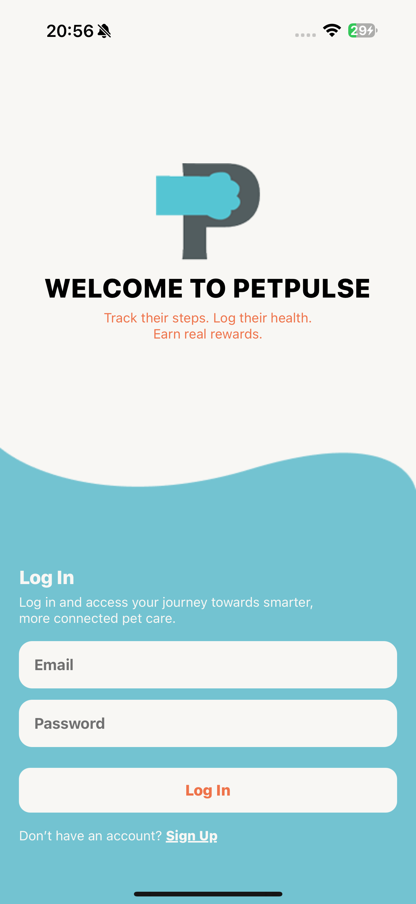

**Login Screen** (`/screens/LoginScreen`)
The Login screen uses Firebase Authentication (Email/Password) to sign users into PetPulse. The UI is clean and minimal with fields for email and password, inline validation, and clear error messages for common cases (e.g., invalid credentials). A “Create account” action routes to Signup, and on successful login the app securely loads the user’s private data (pets, activities, reminders, rewards) via Firestore rules and navigates to Home. The password field is masked and the flow is designed to be fast and frictionless.

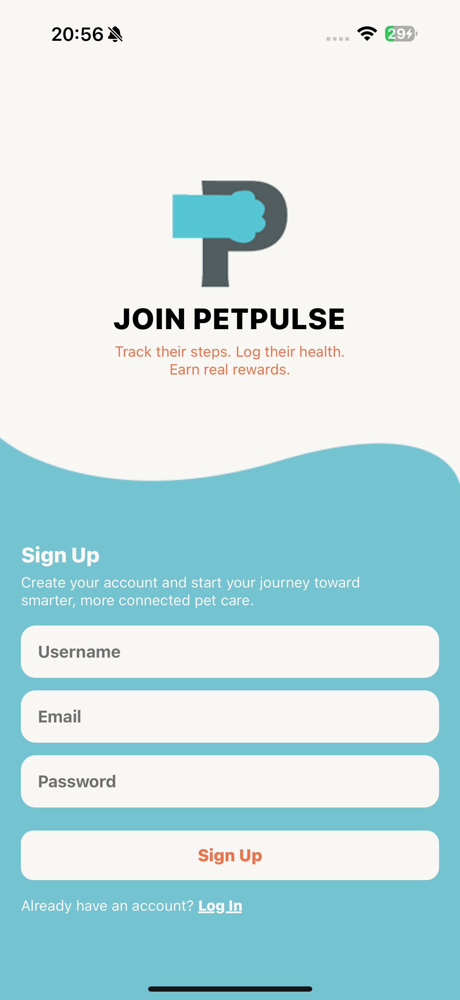

**Signup Screen** (`/screens/SignUpScreen`)
The Signup screen creates a new Firebase user with Email/Password and initializes a corresponding users/{uid} document in Firestore (display name defaults from the email if none is provided). The form includes basic validation (required fields, minimum password length) and surfaces Firebase errors clearly. After successful account creation, the user is taken straight to Home, where they can add their first pet and start tracking activities. All data created from that point is stored under the authenticated user’s Firestore namespace per the app’s security rules.

### Settings Screens

**Pet Settings Screen** (`/screens/PetSettingsScreen`)

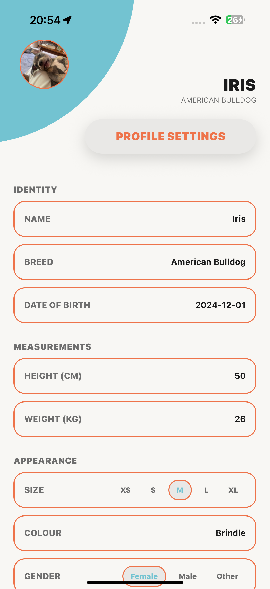

The Pet Settings screen is where you edit an existing pet’s profile. You can update fields such as name, breed, date of birth, size, colour, gender, microchip details, notes, and change the pet’s profile photo. Image updates use Firebase Storage (upload) and the pet document is saved to users/{uid}/pets/{petId} in Firestore. After saving, the updated details flow through the app (PetNav, Home, Activities) immediately.

**User Settings Screen** (`/screens/UserSettingsScreen`)

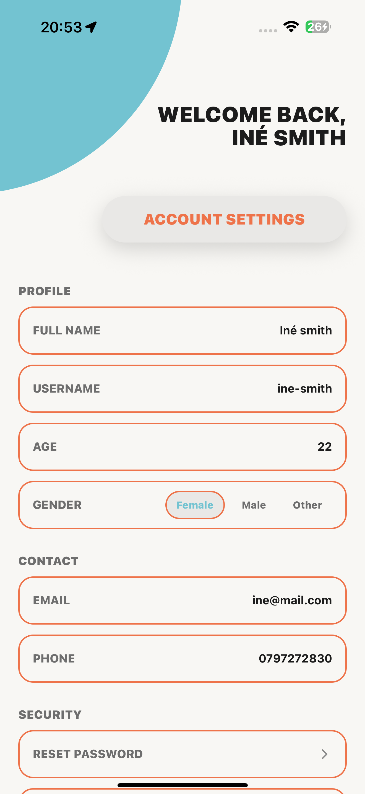

The User Settings screen lets you manage your account basics. You can update your display name (saved to users/{uid} in Firestore) and review your signed-in email. A prominent “Sign out” action securely logs you out via Firebase Auth and returns you to Login. All changes are persisted to Firestore under your authenticated user, respecting the app’s security rules.

### Pet Orientated Screens

**Add Pet Screen** (`/screens/AddPetScreen`)


The Add Pet screen lets you create a new pet profile with a clean, single-form flow. You can upload a profile photo (via expo-image-picker) using a small action menu with “Upload Image” and “View Image,” plus a full-screen preview. Images are uploaded to Firebase Storage using uploadPetImage, and the resulting photoURL/photoPath are saved on the pet document. The form captures the essentials—Name (required), Breed, Date of Birth (YYYY-MM-DD), Height (cm), Weight (kg), Size (XS-XL chips), Colour, Gender, Microchip (Yes/No with details), and Notes—with light validation (e.g., numeric filtering for height/weight). On Create Pet, the screen writes to Firestore at users/{uid}/pets/{newId} with createdAt/updatedAt (serverTimestamp()), stores the optional image fields, and selects the new pet in context so the rest of the app reflects it immediately. If photo permissions aren’t granted, a friendly alert guides the user to enable access.

**Pet Profile Screen** (`/screens/PetProfileScreen`)

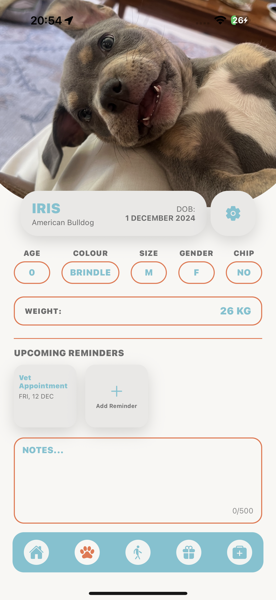

The Pet Profile screen is your pet’s “about” page. It displays the profile photo (from Firebase Storage), core identity fields (name, breed, colour, gender), and quick facts like size and optional chip details. From here you can change the picture (via the same expo-image-picker flow used in Add Pet) and jump to Pet Settings for deeper edits. Data is read from Firestore at users/{uid}/pets/{petId} and rendered with a clean, card-style layout that matches the rest of the app.

**Pet Activities Screen** (`/screens/ActivitiesScreen`)

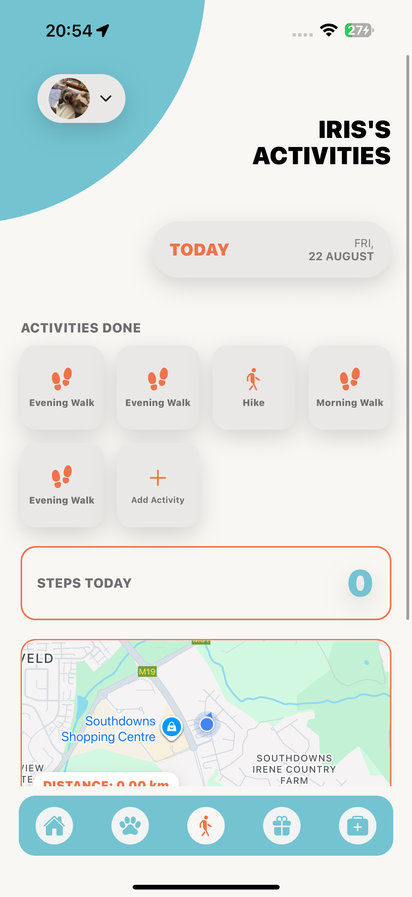

Activities shows what your pet did today and helps you start new tracked sessions. The top grid lists recent activity types; tapping Add Activity opens a modal picker and then navigates to TrackMap. When you finish tracking, the session is saved with meters, steps, elapsedMs, path, and a formatted meta string. The Activities screen then sums Steps Today from all finished sessions and renders a draggable/zoomable Google map (react-native-maps) with polylines for today’s saved paths only. Location comes from expo-location, distance is computed with the Haversine formula, and everything is stored per-pet under users/{uid}/pets/{petId}/activities.

**Pet Health Screen** (`/screens/HealthScreen`)

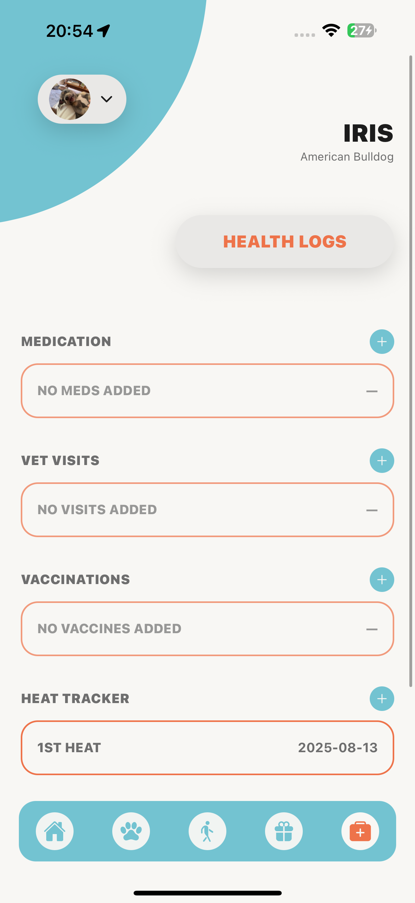

Health is a focused hub for your pet’s wellness. The current version provides the structured layout for sections like vaccinations, medications, and vet visits, designed to tie into your existing Reminders flow per pet. Entries are scoped per pet (users/{uid}/pets/{petId}/health) to keep records separate. As we iterate, these cards will surface due/overdue items and let you log completions that also reflect in reminders.

### User Orientated Screens

**Home Screen** (`/screens/HomeScreen`)

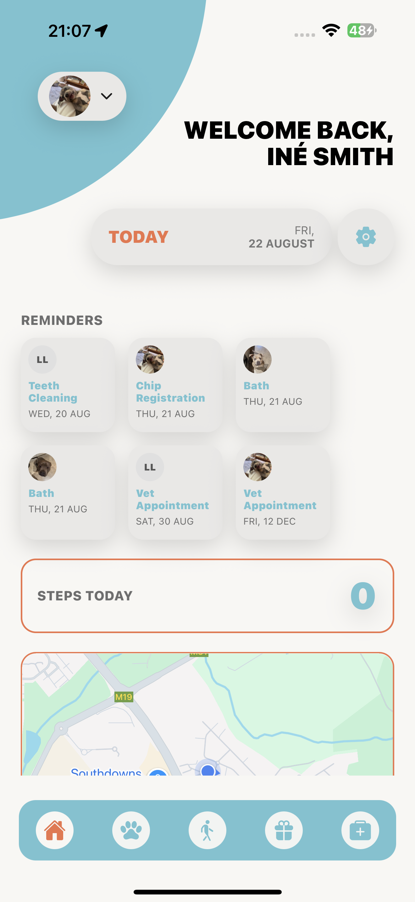

The Home screen greets you by name (loaded from users/{uid} in Firestore) and lets you quickly switch between pets via the PetNav strip. It surfaces upcoming Reminders from each pet’s reminders subcollection (soonest first), and shows Steps Today—calculated only from finished activities saved today in users/{uid}/pets/{petId}/activities (summing the stored steps and meters). A Google Map preview draws today’s saved paths as polylines; it’s fully draggable/zoomable and tapping it won’t navigate away. A compact pill overlays the total distance for the day. If there are no paths yet, the map centers on your current location (with permission via expo-location). A header action links to User Settings, and all sections update live with Firestore onSnapshot listeners under the app’s security rules.

**Rewards Screen** (`/screens/RewardsScreen`)

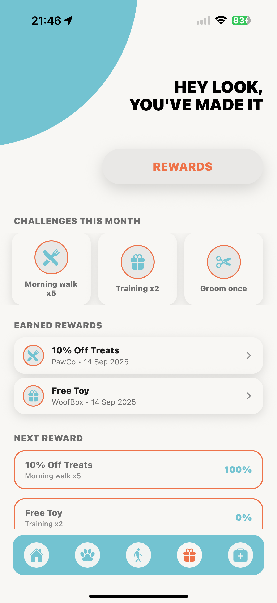

Rewards is split into three parts: (1) a Monthly Missions strip with tappable icons that explain what to do (e.g., “Take your pet to the park 3 times this week”), (2) Next Reward cards showing the voucher title, your progress %, and which activity completes it, and (3) Earned Rewards, a list of unlocked vouchers. Tapping an earned reward opens a redeem modal with full details (title, sponsor, expiry, notes); confirming redemption moves it to Archive. The data model is designed under users/{uid}/rewards (earned/archived) and users/{uid}/rewardPacks (monthly mission definitions), aligning with the app’s Firestore rules.

## Architecture & Components

### Component Structure

- Navigation: React Navigation (native stack)
- Shared UI: BottomNavBar, PetNav, common cards/rows/modals
- Screens: /screens/\* (Home, Activities, TrackMap, Rewards, etc.)
- Context: /context/AuthContext.tsx, /context/PetContext.tsx
- Services: /services/storage.ts (Storage upload), /services/imagePicker.ts
- Utils: /src/utils/pets.ts (doc/collection helpers), Haversine calculator
- The application follows a modular component architecture:

**Navigational Components**

- `BottomNavBar.tsx` - Main navigation sidebar
- `PetNav.tsx` - Pet Selector

**Modals**

- `AddReminderModal.tsx` - Add Reminders

**Contexts**

- `AuthContext.tsx`
- `PetContext.tsx`

**Services**

- `authService.ts`
- `imagePicker.ts`
- `rewards.ts`
- `storage.ts`

**Hooks**

- `useDailyTrack.tsx`

**Utils**

- `pets.tsx`

### State Management

- React Context for Auth and Current Pet
- Local state with hooks
- Firestore onSnapshot for real-time updates per user & pet

### Firestore Structure

- All user data under: users/{uid}/...
- Firestore rules ensure each user can only access their own data
- Storage rules restrict pet images to the authenticated user

- Data Model
  - users/{uid}
    - displayName, email, ...
  - pets/{petId}
    - name, breed, photoURL, ...
  - activities/{activityId}
    - meters, steps, elapsedMs, path: LatLng[], createdAt
  - reminders/{reminderId}
    - title, when
  - rewards/{rewardId}
    - title, sponsor, icon, expiresAt, status: 'earned' | 'archived'
    - rewardTasks/{taskId}
      - title, icon, month (YYYY-MM), requiredActivity, target, progress, status
      - rewardMonths/{yyyyMM}
    - seeded: true, createdAt

<!-- CONCEPT PROCESS -->

## Concept Process

The Concept Process captures the research, planning, and design thinking that shaped PetPulse—a mobile app that turns everyday pet care into a rewarding, trackable routine.

### Ideation

PetPulse centers on four pillars: interaction, sensors, rewards, and landscape support where it adds clarity (e.g., maps). The core idea is to help owners track walks via GPS, log health events, stay on top of reminders, and earn perks for consistent care—making pet wellness visible, organized, and motivating.

### Who & Why (Audience / Problem Statement)

- Designed for pet owners, dog walkers, and pet-care professionals, PetPulse helps users:
- Stay organized with activity and health history
- Receive reminders for meds and vet visits
- Compete in friendly wellness challenges
- Earn real-world perks (e.g., grooming or vet vouchers)

In short, it turns routine care into a rewarding experience that benefits both pets and humans.

### SMART Objectives

- Specific — Track pet activity (GPS routes, distance/steps) and health through daily logs and reminders.
- Measurable — Show distance, step estimates, and task completion toward rewards.
- Achievable — Implemented with Expo + React Native, Google Maps, and Firebase.
- Relevant — Encourages consistent, proactive pet care habits.
- Time-bound — MVP scoped for iterative delivery with weekly milestones.

### Feature Prioritization

- Must-Have (MVP)
  - Pet profiles (multi-pet), GPS walk tracking, step estimates from distance, reminders, rewards, health logs.
- Nice-to-Have
  - Social sharing, richer notification flows, photo journal, leaderboard.
- Future
  - Vet data sync, AI health tips, smart-collar integration.

### Wireframes

Detailed high-fidelity designs were created for all major user flows


### ER-Diagram

![Database ER Diagram][er-diagram]

<!-- DEVELOPMENT PROCESS -->

## Development Process

The `Development Process` details the technical implementation and methodologies used in building Coriander HR.

### Implementation Process

- Location & Maps: expo-location watch; Haversine distance; jitter filtering
- Persistence: Firestore with serverTimestamp()
- Images: expo-image-picker → Firebase Storage upload → stored photoURL
- Rewards: monthly seeding, task progress, earned → redeem → archive

### Highlights

- Highlights
- Saved-only flow: moving on the map doesn’t affect totals until you end & save
- Per-pet, per-day stats with clean separation via PetNav
- Maps are interactive (drag/zoom) but tap-safe (no accidental navigation)

### Challenges

- Permission flows (Location & Photos) across iOS/Android
- Firestore/Storage rules to prevent cross-user access
- Map region management (auto-fit routes vs user location fallback)
- Manual validation flows:
  - Add pet + upload photo
  - Track activity → End & Save → verify Steps Today and map routes update
  - Switch pets → verify isolation of stats/routes
- Create reminders → verify ordering
- Rewards: do-to-earn → progress → earned → redeem → archive

### Future Implementation

**Admin Registartion**

- Where Businesses / Companies can register to upload rewards.
- To add specials.
- Doctors can upload pet health logs from their side.

**Enhanced Authentication**

- Invite-based registration system (for family members)
- Password reset functionality
- Two-factor authentication

**Future Features**

- Wider Activity History

<!-- MOCKUPS -->

## Final Outcome

### Mockups


<br>


Final Outcome

PetPulse delivers a focused, mobile companion for dog owners that feels fast, clear, and reliable. The app ties together GPS activity tracking, per-pet data, reminders, and rewards into one cohesive experience backed by Firebase.

- Clean, mobile-first interface that’s consistent across iOS and Android (Expo + React Native)
- Simple, secure authentication (Firebase Auth) with user-scoped Firestore/Storage
- Rich pet profiles with image upload to Firebase Storage
- Accurate GPS activity tracking with steps & distance, saved per session and aggregated per day/per pet
- Draggable/zoomable Google Maps with polylines for today’s completed sessions only
- Per-pet Reminders to keep health and routines on track
- Monthly-mission Rewards with progress, redeem modal, and archive flow
- Real-time sync via Firestore and clear, maintainable app structure for future growth

### Video Demonstration

To see a complete walkthrough of the PetPulse application, click below:

[View Demonstration](https://)

<!-- ROADMAP -->

## Roadmap

See the [open issues](https://github.com/inesmith/PetPulse/issues) for a list of proposed features and known issues.

<!-- AUTHORS -->

## Authors

- **Iné Smith** - [inesmith](https://github.com/inesmith)

<!-- LICENSE -->

## License

Distributed under the MIT License. See `LICENSE` for more information.

<!-- CONTACT -->

## Contact

- **Iné Smith** - Primary: 221076@virtualwindow.co.za. Project Link: https://github.com/your-org/petpulse

<!-- ACKNOWLEDGEMENTS -->

## Acknowledgements

**Technologies and Libraries**

- Expo – Tooling, runtime, and build service for React Native
- React Native – Cross-platform mobile framework for iOS & Android
- TypeScript – Type-safe JavaScript for better DX and maintainability
- React Navigation – Stack/tab navigation
- gluestack UI – Headless, themeable UI components
- Ionicons – App icon set
- expo-location – Foreground location permissions & GPS updates
- react-native-maps – Map rendering (Google Maps provider), markers & polylines
- Firebase Authentication – Email/password auth
- Cloud Firestore – User-scoped realtime data storage
- Cloud Storage for Firebase – Image uploads for pet profiles
- expo-image-picker – Select images from the device library
- react-native-safe-area-context – Safe area handling

**Design and Assets**

- Google Maps Platform – Basemaps/tiles used in the app’s maps (Map data © Google)
- Ionicons – Icons used across the UI

**Development Tools**

- Expo CLI – Local development & builds
- Expo Go – On-device preview and testing
- Firebase Console – Project configuration, Firestore/Storage rules & monitoring
- GitHub – Version control and issue tracking

<!-- Markdown Images -->
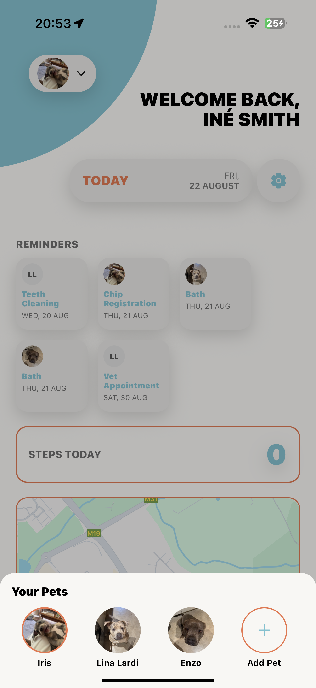


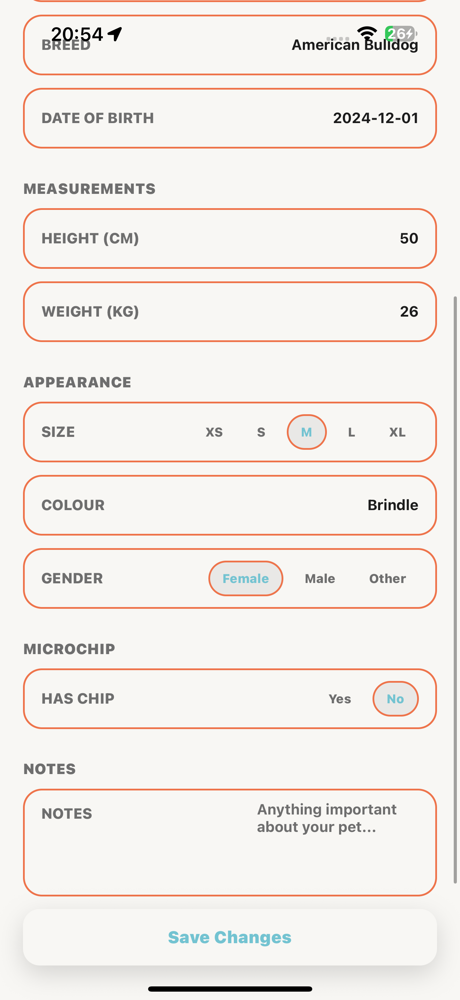
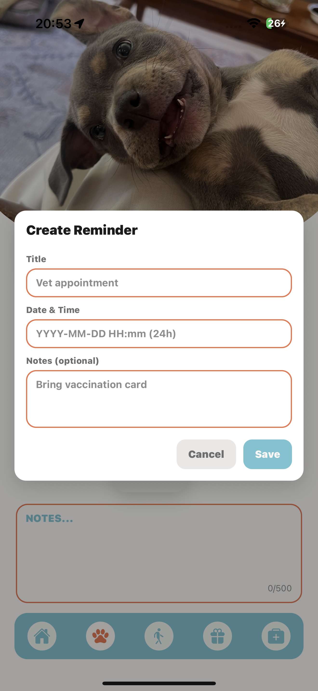


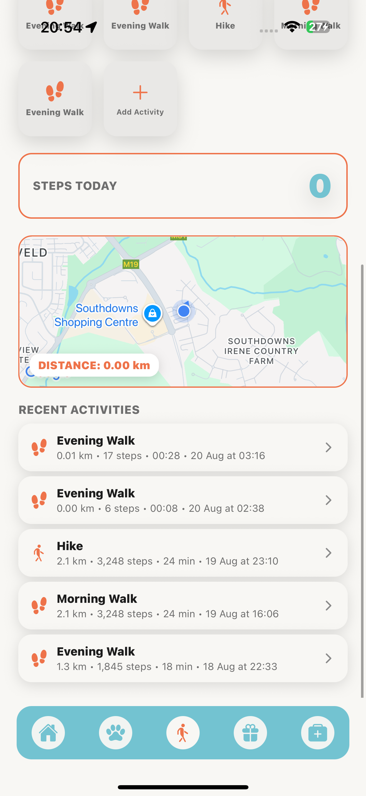


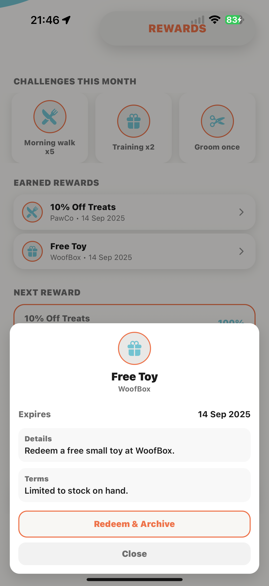


